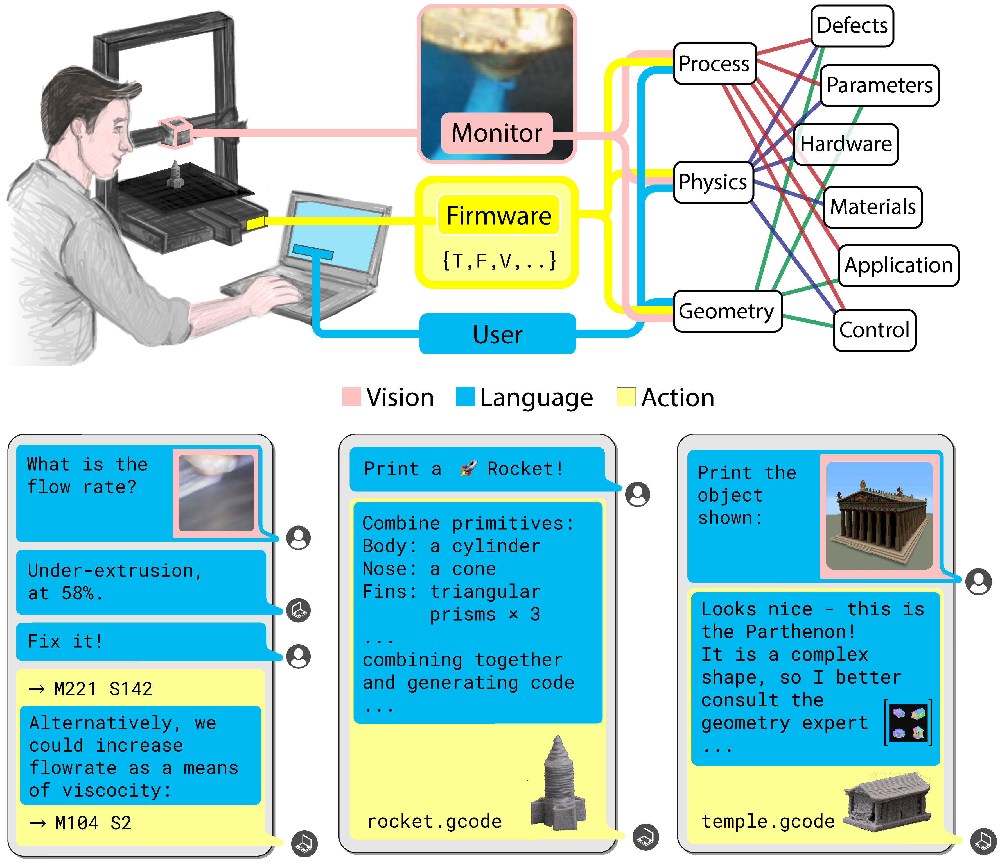
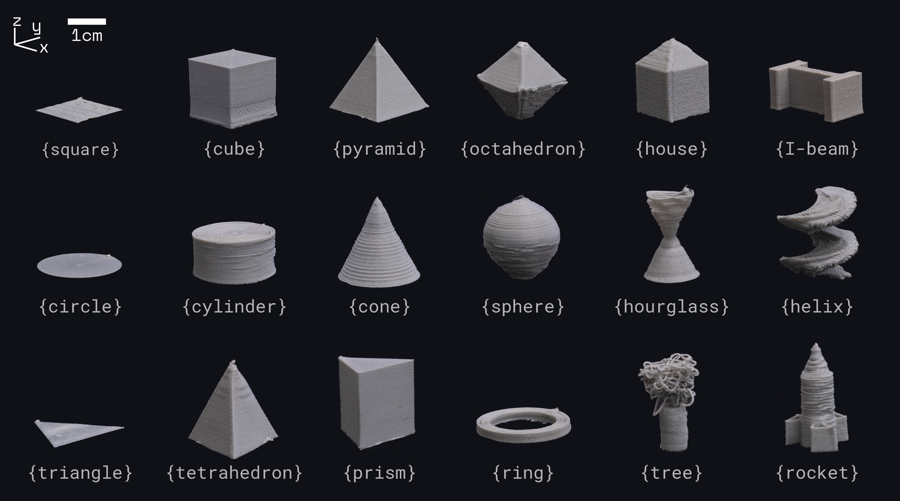

# CIPHER : Control and Interpretation of Production via Hybrid Expertise and Reasoning 

Industrial systems need to handle changing conditions and catch errors quickly, but traditional AI controllers often rely on large, labelled datasets and struggle with new situations. We present CIPHER, a hybrid vision-language-action framework designed for precise, human-like reasoning in industrial control. CIPHER combines:
- A process expert (a regression model) to quantify system states,
- Retrieval-augmented generation for tapping into external knowledge,
- Physics-informed chain-of-thought reasoning to guide decisions.

Tested on a commercial 3D printer, CIPHER generalizes well to tasks it hasn’t seen before. It can interpret camera images or text logs, explain its choices step by step, and generate exact machine commands—all without needing custom annotations. By merging data-driven learning with expert rules and transparent reasoning, CIPHER paves the way for reliable, safe, and explainable autonomous control in real-world factories.

<p align="center">
  
  <br>
  <em>Figure&nbsp;1 – CIPHER translates textual/visual prompts into printer commands, through physics- and geometry-informed reasoning.</em>
</p>

### Autonomous design and printing

<p align="center">
  
  <br>
  <em>Figure&nbsp;2 – Send pics of your AI-generated printed parts at {cm2161@cam.ac.uk} to be featured in our project page!</em>
</p>

<hr style="border: 2px solid gray;"></hr>

### Codebase structure

```
CIPHER/
├── main.py                 # Entry point for training CIPHER agents
├── requirements.txt        # Python dependencies
├── src/                    # Core CIPHER framework
│   ├── config.py           # Configuration and hyperparameters
│   ├── model.py            # Main VLA model implementation
│   ├── vexpert.py          # Vision expert for process monitoring
│   ├── train.py            # Training loops and callbacks
│   ├── utils.py            # Helper functions and utilities
│   └── data
│       ├── data_utils.py   # Data loading/processing
│       └── *.json          # json files for process knowledge
```

<hr style="border: 2px solid gray;"></hr>

## Models

You will need to download [[a different version of the OpenVLA model checkpoint]](https://huggingface.co/openvla/openvla-7b-prismatic) that is compatible
with the Prismatic VLMs codebase, which we built on top of to develop the OpenVLA model. You can download this Prismatic-compatible OpenVLA checkpoint using the git commands below
(alternatively, you can download via the [Hugging Face CLI](https://huggingface.co/docs/huggingface_hub/main/en/guides/cli)):

```bash
# Change directory to your base model checkpoints folder
cd <PATH TO BASE CACHE_DIR>

# Download checkpoint (30 GB) -- may take a few minutes
git clone git@hf.co:meta-llama/Llama-3.2-11B-Vision-Instruct
```

Our process expert architecture is based on the [ResNet-50](https://huggingface.co/microsoft/resnet-50) model, our implementation is in [/src/vexpert.py](https://github.com/cam-cambridge/CIPHER/blob/main/src/vexpert.py)

Explicit Notes on Model Licensing & Commercial Use: While all code in this repository is released under an MIT License, our pretrained models may inherit restrictions from the underlying base models we use. Specifically, CIPHER is derived from Llama-3.2, and as such are subject to the Llama Community License.

<hr style="border: 2px solid gray;"></hr>

## Requirements and setup
- cuda>=11
- torch>=1.7
- Python >= 3.11

```python
# creating a virtual environment
> python3.11 -m venv .venv
> source .venv/bin/activate
```
- See `requirements.txt` for full dependencies
```python
# Install minimal dependencies (`torch`, `transformers`, `timm`, `tokenizers`, ...)
> pip install -r requirements.txt
```
- Set your cache at a directory with adequate storage; we will download checkpoints there (~30 GB)
```python
# in ./src/config.py
> CACHE_DIR = "./cache"
```
- Configure your huggingface token
```python
# in ./src/config.py
> HF_TOKEN = "hf_..."
```

## Fine-tune a CIPHER agent on your data
```python
python main.py
```
See main.py and data/data_utils.py for training file structures.

#### Citation

If you find our code or models useful in your work, please cite [our paper](.):
-- To be added post-publication