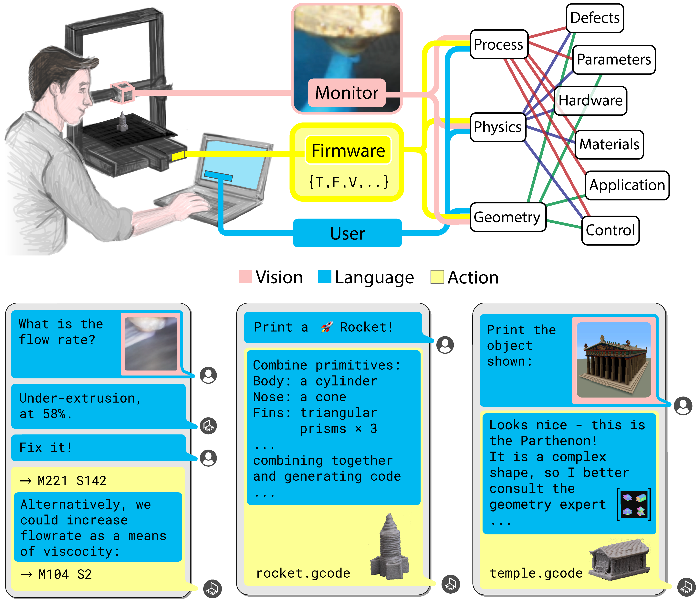
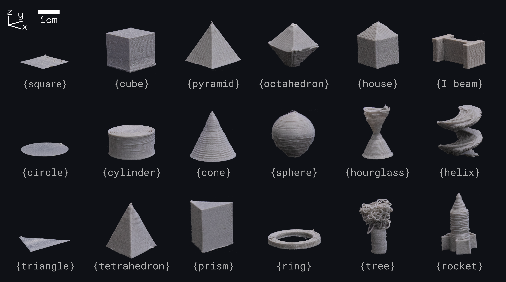

# CIPHER : Control and Interpretation of Production via Hybrid Expertise and Reasoning 

<p align="center">
  
  <br>
  <em>Figure&nbsp;1 – CIPHER translates textual/visual prompts into printer commands, through physics- and geometry-informed reasoning.</em>
</p>

### Autonomous design and printing

<p align="center">
  
  <br>
  <em>Figure&nbsp;2 – Send pics of your AI-generated printed parts at {cm2161@cam.ac.uk} to be featured in our project page!</em>
</p>

<hr style="border: 2px solid gray;"></hr>

### Codebase structure

```
CIPHER/
├── requirements.txt              # install Python dependencies
├── src/                    
│   ├── config.py                 # Configuration and hyperparameters
│   ├── model.py                  # Main VLA model implementation
│   ├── vexpert.py                # Vision expert for process monitoring
│   ├── rag.py                    # RAG context retrieval pipeline
│   ├── train.py                  # Training loops and callbacks
│   ├── main.py                   # Training loops and callbacks
│   └── utils
│       ├── data_utils.py   
│       ├── test_utils.py   
│       └── utils.py
├── knowledge_generation/         # Knowledge map generation pipeline
│   ├── cli.py                    # Typer CLI entry point
│   ├── utils.py                  # Console helpers, retry logic
│   └── stages/
│       ├── hierarchy.py          # Stage 1: LLM taxonomy generation
│       ├── facts.py              # Stage 2: per-node fact generation
│       ├── embeddings.py         # Stage 3: fact embedding (OpenAI / local)
│       └── visualization.py      # Stage 4: t-SNE plots & summaries
├── scripts/
├── prompts/
└── assets/

```

<hr style="border: 2px solid gray;"></hr>

## Setup environment
### Requirements and setup
- cuda>=11
- torch>=1.7
- Python >= 3.11
```bash
git clone git@github.com:cam-cambridge/CIPHER.git
cd CIPHER
python3 -m venv .venv
source .venv/bin/activate
pip install -r requirements.txt
export HF_TOKEN=hf_********************************
```
where ******************************** is your HF key (see https://huggingface.co/docs/hub/en/security-tokens)

Installation of all packages and token setup should take <10 minutes.

## Train

```bash
bash scripts/train.sh
```
The pre-trained [microsoft/ResNet-50](https://huggingface.co/microsoft/resnet-50) model and the pre-trained [meta-llama/Llama-3.2-1B](https://huggingface.co/meta-llama/Llama-3.2-1B) will be fetched from Hugging Face. The train dataset (subset) will be fetched from [cemag/tl-caxton](https://huggingface.co/datasets/cemag/tl-caxton).

We train on 4 × NVIDIA A100 80GB in less than a day. LoRA models can be trained with significantly fewer resources.

Explicit Notes on Model Licensing & Commercial Use: While all code in this repository is released under an MIT License, our pretrained models may inherit restrictions from the underlying base models we use. Specifically, CIPHER is derived from Llama-3.2, and as such are subject to the Llama Community License.

## Inference / Tests
We have prepared test scripts for the experiments as seen in the paper.
Available scripts:
<table>
  <thead>
    <tr>
      <th>Script</th>
      <th>Details</th>
    </tr>
  </thead>
  <tbody>
    <tr>
      <td><code>ask.sh</code></td>
      <td>
        Ask a single question to the model<br/>
        <strong>Args:</strong> <code>--model_path</code>, <code>--question</code>, <code>--results_path</code>
      </td>
    </tr>
    <tr>
      <td><code>test_flowrate_predictions.sh</code></td>
      <td>
        Test flowrate predictions on test dataset<br/>
        <strong>Args:</strong> <code>--test_samples</code>, <code>--batch_size</code>, <code>--model_path</code>, <code>--data_path</code>, <code>--results_path</code>
      </td>
    </tr>
    <tr>
      <td><code>test_vanilla_control.sh</code></td>
      <td>
        Test vanilla control performance<br/>
        <strong>Args:</strong> <code>--model_path</code>, <code>--num_questions</code>, <code>--prompt_path</code>, <code>--results_path</code>
      </td>
    </tr>
    <tr>
      <td><code>test_domain_expertise.sh</code></td>
      <td>
        Test domain expertise with/without RAG<br/>
        <strong>Args:</strong> <code>--model_path</code>, <code>--questions_path</code>, <code>--rag</code>, <code>--results_path</code>, <code>--context</code>
      </td>
    </tr>
    <tr>
      <td><code>test_overfit.sh</code></td>
      <td>
        Test models catastrophic forgetting on SQUAD (language) and Flickr30 (image) datasets<br/>
        <strong>Args:</strong> <code>--test_samples</code>, <code>--model_path</code>, <code>--results_path</code>
      </td>
    </tr>
  </tbody>
</table>

Each script has a help menu accessible via `-h` or `--help` flag.
Scripts output .csv files saved under RESULTS_PATH (by default ="./results") in scripts.

Any of these experiments can run using
```bash
bash scripts/{script.sh}
```
<hr style="border: 2px solid gray;"></hr>

## RAG (Retrieval-Augmented Generation)

CIPHER can optionally augment its answers with domain-specific facts retrieved at inference time. The pipeline lives in `src/rag.py` and works in three stages:

### 1. Fact store

A pre-embedded knowledge base (`processed_facts_openai.json`) is hosted on the [cemag/tl-caxton](https://huggingface.co/datasets/cemag/tl-caxton) Hugging Face dataset. Each entry contains the original fact text and its embedding vector (generated with OpenAI `text-embedding-ada-002`). The file is downloaded and cached automatically on first use.

### 2. Retrieval

When a question is received, `ContextManager.find_relevant_facts()`:

1. Embeds the question with `text-embedding-ada-002`.
2. Computes cosine similarity against every fact embedding.
3. Returns the top-*N* most similar facts (default *N* = 5) as a single context string.

### 3. Injection

`ContextManager.add_context_to_examples()` attaches the retrieved context to each example under the `context` key. When `format_data_with_system()` is called with `RAG=True`, the context is appended to the user message before it is sent to the model.

### Usage

RAG requires an OpenAI API key for embedding generation:

```bash
export OPENAI_API_KEY=sk-********************************
```

To run domain-expertise evaluation **with** RAG:

```bash
bash scripts/test_domain_expertise.sh --rag
```

To use `ContextManager` directly:

```python
from src.rag import ContextManager

ctx = ContextManager()                          # downloads & caches facts
facts = ctx.find_relevant_facts("What causes    # retrieve top-5 facts
    under-extrusion in FDM?", num_facts=5)

examples = [{"question": "Why is my print warping?"}]
examples = ctx.add_context_to_examples(examples) # attach context
```

## Generating Custom Knowledge Maps

The `knowledge_generation` pipeline lets you build your own domain-specific knowledge bases for any manufacturing topic. The output can be plugged directly into CIPHER's RAG system (see above) to give the model expertise in new domains.

### Pipeline overview

The pipeline runs four stages in sequence:

| Stage | Description | Output |
|-------|-------------|--------|
| 1. Hierarchy | An LLM generates a structured taxonomy of the topic (two-pass refinement) | `hierarchies.txt` |
| 2. Facts | The LLM generates detailed facts for every node in the hierarchy (resumable with checkpoints) | `hierarchy_with_facts.json` |
| 3. Embeddings | Each fact is embedded into a vector space (OpenAI `text-embedding-ada-002` or local sentence-transformers) | `processed_facts.json` |
| 4. Visualization | t-SNE scatter plots, category distribution charts, and summary tables | `*.png`, `*.html` |

### Prerequisites

An OpenAI API key is required (stages 1-3 use the OpenAI API). Add it to your `.env` file:

```bash
cp .env.example .env
# then edit .env and set:
#   OPENAI_API_KEY=sk-********************************
```

### Running the pipeline

```bash
source .venv/bin/activate

# Basic usage — generates a knowledge map for "Additive Manufacturing"
python -m knowledge_generation "Additive Manufacturing"

# Specify a custom output directory
python -m knowledge_generation "CNC Machining" --output-dir ./output/cnc

# Use a different chat model
python -m knowledge_generation "Injection Molding" --model gpt-4o

# Use local sentence-transformers instead of OpenAI for embeddings
python -m knowledge_generation "Laser Sintering" --embedding-provider local

# Resume from a specific stage (earlier artifacts must already exist)
python -m knowledge_generation "Additive Manufacturing" --skip-to 3
```

### CLI options

| Option | Short | Default | Description |
|--------|-------|---------|-------------|
| `--output-dir` | `-o` | `knowledge_generation/output/<topic_slug>` | Directory for all output artifacts |
| `--model` | `-m` | `gpt-4` | OpenAI chat model for hierarchy and fact generation |
| `--embedding-provider` | `-e` | `openai` | Embedding backend: `openai` or `local` |
| `--embedding-model` | | `sentence-t5-large` | Sentence-transformers model name (only with `--embedding-provider local`) |
| `--skip-to` | `-s` | `1` | Skip to stage N (1-4); earlier artifacts must already exist |

### Integrating a custom knowledge map with CIPHER's RAG

The pipeline produces a `processed_facts.json` file whose format is directly compatible with `ContextManager` in `src/rag.py`. Each entry contains:

```json
{
    "id": 1,
    "category": "Materials",
    "original_fact": "PLA is a biodegradable thermoplastic ...",
    "embedding": [0.012, -0.034, ...]
}
```

To use your custom knowledge map with CIPHER, pass the path to `ContextManager`:

```python
from src.rag import ContextManager

# Point to your locally generated facts instead of the default HF dataset
ctx = ContextManager(facts_file_path="knowledge_generation/output/additive_manufacturing/processed_facts.json")

facts = ctx.find_relevant_facts("What causes warping in FDM?", num_facts=5)
```

> **Note:** If you generated embeddings with `--embedding-provider local`, the vectors will have a different dimensionality than OpenAI's `text-embedding-ada-002`. In that case, query embeddings must also be generated with the same local model for cosine similarity to be meaningful.

<hr style="border: 2px solid gray;"></hr>

#### Citation

⭐ If you find our code or models useful in your work, please cite our paper:

Christos Margadji & Sebastian W. Pattinson (2025). *Hybrid Reasoning for Perception, Explanation, and Autonomous Action in Manufacturing*. [arXiv:2506.08462](https://arxiv.org/abs/2506.08462)
```bash
@article{MargadjiPattinson2025HybridReasoning,
  title   = {Hybrid Reasoning for Perception, Explanation, and Autonomous Action in Manufacturing},
  author  = {Margadji, Christos and Pattinson, Sebastian W.},
  year    = {2025},
  note    = {arXiv:2506.08462},
  url     = {https://arxiv.org/abs/2506.08462}
}
```
